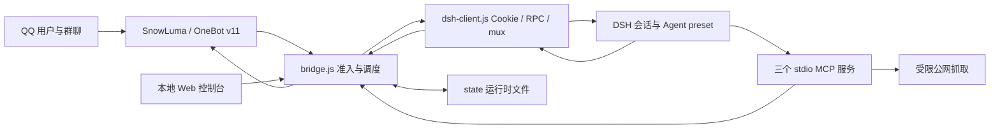

# qq-bridge 架构审查与修复报告

日期：2026-09-18  
审查对象：`D:\LWQ\Agent Workspace\DSH\qq-bridge`  
基线：`3c54e6b`，项目版本 `0.1.5`，审查开始时 Git 工作区干净。  
验证环境：Windows，Node.js `v22.23.2`。协议形状另外对照本机 DSH 安装中的 API 类型与实现；未向实际 DSH 提交任务。

## 1. 结论与范围

项目的设计意图清楚：以 QQ 为交互入口，把聊天、角色管理与自主群聊交给 DSH，同时通过桥接准入规则、受限 preset、MCP 工具和发送审计控制权限。`closed-agent` 有意允许管理员远程使用完整本机工具；其余模式应保持受限聊天权限。这两种权限不能因会话复用或异步竞态而混在一起。

本次审查确认并修复了会话权限继承、异步队列竞态、鉴权和订阅恢复、联网资源限制、敏感内容漏检、表情数据处理、安装配置损坏等问题。修复集中在可复现的行为，没有重写整体架构，也没有替换现有的人格或社交策略。

阅读范围包括 README、RULES、公开项目说明、安装说明、全部核心源模块、两套 preset、模式插件、控制台脚本和主要测试/运维脚本。主程序约 8,200 行，是状态管理与安全检查最集中的部分。

验证以真实函数配合临时文件、模拟 DSH/QQ、模拟网络和隔离安装环境完成。没有运行会真实发 QQ 消息或改在线白名单的测试，没有读取实际配置中的凭据，没有执行真实 DSH 安装脚本或重启在线服务。本报告不等同于第三方依赖漏洞数据库扫描、渗透测试或线上端到端验收。

## 2. 架构与设计意图



### 2.1 模块职责

| 模块 | 实际职责与边界 |
| --- | --- |
| `src/bridge.js` | QQ 准入、管理员命令、会话映射、模式轮询、离线队列、回复审计、控制台 HTTP API、一代/二代调度、媒体与表情编排。 |
| `src/dsh-client.js` | launch token 换 Cookie；旧调用门面转换为斜杠 RPC；`remote.mux` 下的会话 follow、提问/审批；回合文本收集。新增退役会话的清队列与取消操作。 |
| `src/mcp-snowluma-safe.js` | 向 DSH 暴露 QQ 动作安全子集；二代工具经桥接校验会话 token、目标与功能开关。 |
| `src/mcp-host-server.js` | 默认只读探活；进程启停须明确开启且处于 `closed-agent`。 |
| `src/mcp-web-search-safe.js` / `src/safe-fetch.js` | 只读搜索与网页/图片下载；修复后共用 DNS、地址、重定向、大小和时限防护。 |
| `src/slang-learner.js` | 黑话数据归一化、候选提取和研究提示；只有管理员确认后的词条进入聊天上下文。学习会话的生命周期仍由 bridge 管理。 |
| `src/sticker-lib.js` / `src/forward.js` / `src/md-to-plain.js` | 表情知识库与匹配、合并转发结构解析、QQ 纯文本与分段。 |
| `dsh/agent-presets/qq-chat*` | 聊天人格与工具面限制。执行期 guard 是比自然语言人格规则更重要的权限边界。 |
| `scripts/setup-dsh.mjs` | 安装 preset、维护 DSH profile 的 MCP 项、注册模式插件、初始化本地模式兜底。 |
| `plugins/qq-mode-console` | 注册 DSH 的 `qq-mode` 设置命名空间；只有 host 端，未实现 DSH 页面卡片。 |
| `public/console.html` | 令牌鉴权的本地管理界面；真正的校验与写入发生在 bridge HTTP 路由中。 |

### 2.2 四种模式

| 模式 | 准入 | preset / 输出方式 |
| --- | --- | --- |
| `chat` | 白名单私聊和群，受黑名单约束 | `qq-chat`；回合结束后转发文本。 |
| `closed-agent` | 仅当前 `ownerQQ` 的私聊 | DSH 默认或管理员指定 preset；完整工具是有意设计。 |
| `reserved` | 白名单私聊和群 | `qq-chat`；桥接负责观望、参与、退场、分句与延迟。 |
| `reserved2` | 白名单私聊和群 | `qq-chat-v2`；文本不自动转发，模型通过工具读消息、发送、等待和设置唤醒。 |

### 2.3 状态与安全边界

- `state/sessions.json` 记录 QQ key 到 DSH session 的映射；本次新增 `sessionPolicies`，保存创建时的模式、preset、封闭模式管理员边界。
- `state/social-v2.json` 保存二代会话、消息窗口、唤醒配置与 agent token；角色、黑话、表情和日志分别持久化。
- DSH 设置通常优先于本地 `mode.json`。控制台写 DSH 失败时，本地切换可能被后续轮询覆盖，界面已有提示；不能把它描述成可靠的双向同步事务。
- `consoleToken` 是管理凭据，agent token 是会话隔离凭据。MCP 服务本身属于可信宿主代码，不能将其进程环境视为与本机隔离的沙箱。
- QQ 输入、网页正文、昵称和转发内容都应视为不可信数据。角色提示和“只有管理员才可发送”的人格规则不能替代执行期校验。

## 3. 已修复问题

P1 表示可能破坏主要权限或可用性边界、应优先修复；P2 表示明确的可靠性、配置或有条件风险；P3 表示较小的行为/文档问题。这不是外部 CVSS 评级。

### 3.1 会话权限与桥接并发

| 编号 | 优先级 | 原问题、触发条件与影响 | 修复 |
| --- | --- | --- | --- |
| B1 | P1 | `ensureSession()` 只按 QQ key 复用 DSH session。管理员从 `closed-agent` 切回 `chat` 后仍可能继续使用带本地工具的旧 preset，违反 RULES 的降权承诺。 | 持久化权限元数据；模式/preset/准入变化时撤销旧映射、取消待处理交互、轮换二代 token、清理调度；走 `retireSession` 的路径会在 DSH 清理该会话待处理消息、取消当前回合并归档（重置路径的同等处理见 §3.5）。下次消息创建合适的 session。 |
| B2 | P1 | preset 清单未知时 strict 仍返回配置名；学习会话也没有同等校验。DSH 接受未知 preset 并应用默认配置时可能形成权限降级失败。 | strict 在清单未知/缺少目标时拒绝使用；黑话学习会话同样检查，持久化 preset 身份，不复用没有元数据的旧学习映射。复核时对照本机 DSH 源码（`presets.resolve()` 对未知 preset 返回 `agent-preset/not-found`），本机版本其实会拒绝未知 preset，因此这里是纵深防御与更清晰的报错；代价见 §7.8。 |
| B3 | P2 | 创建会话、选择模型或解析图片期间发生 reset/切模式，旧异步操作仍可能返回/投递到过期 session。 | 在异步边界后复核代际、权限策略、映射和准入；旧事件、提问和审批不再当成当前会话处理。 |
| B4 | P2 | 消息进入发送队列后撤销白名单或切换模式，已排队内容仍会发送。 | 普通回复、一代分条、二代消息、表情与收藏动作在实际发出前复核；过期发送取消并记录原因。已经进入网关的请求无法撤回。 |
| B5 | P2 | reset 后旧 prompt 的 `finally` 无条件删除相同 key 的队列，可能删掉新队列，导致顺序失控或后续等待挂起。 | 只有 map 中仍是原 entry 时，旧任务才可继续处理或删除它。 |
| B6 | P2 | 控制台在 handler 的保护范围外解析 URL。`http://[` 等畸形 request target 导致未处理拒绝；生产处理器虽会记录，却不会正常回应请求。 | 捕获 URL 解析错误并返回 HTTP 400、关闭连接；无需令牌也能触发的异常路径已被覆盖。 |

最初五项桥接回归在旧代码上全部失败：跨模式复用、清单未知放行、创建期间模式改变、撤销白名单后仍发送、旧队列删除新队列。修复后这些场景及追加的历史映射、模型选择 reset、畸形 HTTP、控制台重置清理、表情字节发送场景全部通过。

### 3.2 DSH 鉴权与事件恢复

| 编号 | 优先级 | 原问题 | 修复 |
| --- | --- | --- | --- |
| D1 | P2 | `promise.finally()` 的返回 promise 未处理。原始鉴权失败即使被调用方捕获，仍会产生额外的 unhandled rejection。 | 成功/失败清理都挂在已处理链上。独立 MCP/测试进程不再因此触发默认退出行为；桥接也不再产生这类额外错误。 |
| D2 | P2 | 多个旧 Cookie 请求同时返回 401，相互使已经开始的新鉴权失效。 | 以鉴权代际判断是否仍需失效，复用同一次刷新；释放废弃响应正文。 |
| D3 | P2 | token 交换没有独立时限，调用方取消不能及时结束等待；预取消事件流仍可能开 socket。 | 换票使用有界时限；调用方可以独立取消等待而不破坏其他共享调用；建 socket 前检查取消状态。 |
| D4 | P2 | follow 发送失败仍保留“已订阅”状态；`$events` 单独结束或报错后不恢复；临时 follow 错误被当成永久消失。 | 发送失败撤销记录并结束传输；提问/审批流失效触发整条 mux 重连；只有 `session/not-found` 永久移除订阅，临时错误保留后重试。 |
| D5 | P1（支撑 B1） | DSH `session/cancel` 保留 inbox，`archiveSession` 仅归档显示，二者单独使用不能终止已经排队的高权限工作。 | 新增有界 `stopSessionWork()`：读取 `session/control` baseline，仅删除目标 session 的 itemId，然后 cancel；独立 socket 在正常、失败、超时路径关闭。默认总时限 8 秒，失败明确记录。**该清理是尽力而为，不是服务端原子事务**：`stopSessionWork` 失败时归档仍会继续，已在执行的工具副作用不能撤回；重置路径的同等处理见 §3.5。 |

RPC 的 `session/cancel` / `session/updateQueue` 参数和 `session/control` baseline 形状对照了本机 DSH 类型与实现，并使用模拟 socket/RPC 验证。该流程并非服务端原子事务；已执行工具的副作用不能撤回。

### 3.3 网络与内容安全

| 编号 | 优先级 | 原问题与利用条件 | 修复 |
| --- | --- | --- | --- |
| S1 | P1 | 表情 URL 只在桥接校验一次，随后原样交给 OneBot 再抓取。可控公网地址的重定向或二次 DNS 解析可能绕过桥接 SSRF 防护。 | 桥接通过安全下载取得并验证图片字节，交给 OneBot 的是 `base64://` 内容；网关不再自行追踪该 URL。 |
| S2 | P2 | 抓取只设置空闲超时，持续缓慢输出可以长期占用；重定向正文继续下载。 | 文本和图片共用传输，每跳 20 秒总时限覆盖连接、头和正文；立即关闭重定向正文，正确处理超限、aborted 和 close。 |
| S3 | P2 | Bing 搜索使用另一套普通 fetch，自动重定向与正文读取没有同等边界。 | 搜索同样走安全传输，正文最多 512,000 个 Unicode 码点；网页默认 50,000，图片默认 4 MiB。 |
| S4 | P2（条件性） | 展开的 IPv4-mapped IPv6 环回地址、本地 NAT64 前缀在部分表示下被误判为公网。利用取决于 DNS 返回形式或网络路由。 | 先规范化 IPv6，再校验本地地址、NAT64、非法地址和区域标识；所有 DNS 结果仍全量检查，连接固定到已校验 IP。 |
| S5 | P2 | 正常 UNC 路径与带引号 JSON 凭据，如 `\\server\share\private.txt`、`{"token":"fixture-value"}`，漏过共享正则。 | 补齐路径/引号规则，保留普通“如何设置密码”等问句的行为。它仍是启发式过滤，不是完整秘密检测器。 |
| S6 | P2（条件性） | 两套 guard 允许裸 `web_fetch/web_search`；若其他插件注册同名工具，可能绕开安全 MCP 命名空间。 | 移除裸名称放行，同时拒绝空/无效工具名。按 RULES 只允许对应 MCP 命名空间和明确的内置交互工具。 |

排除项：空 agent token 继承控制台权限的疑点经过复查，已有全局拒绝规则，因此没有作为漏洞计数。已检查的控制台 HTML 动态输出普遍使用转义或 `textContent`，未确认可利用 XSS。

### 3.4 数据与安装可靠性

| 编号 | 优先级 | 原问题 | 修复 |
| --- | --- | --- | --- |
| F1 | P2 | 表情 API 只取最多 count 条，但合并逻辑把未返回条目当成已删除，导致库较大时丢失笔记和统计。 | 区分完整与可能截断的结果；返回数量达到请求上限时保留未返回记录。由于 API 缺少本次已验证的完整分页信息，此时优先保留，可能延迟清理真正删除的记录。 |
| F2 | P2 | 表情模糊 URL 子串匹配可能先选中错误条目。 | 优先精确 id/md5；URL 比较使用规范化完整地址，兼容查询参数更新，不再任意子串匹配。 |
| F3 | P3 | QQ 在换行处分段可能超过声明长度；单对象形式的合并转发节点丢失图片/嵌套转发元数据。 | 修正换行边界；统一处理单对象消息段并保留媒体、嵌套引用。 |
| I1 | P1（配置完整性） | 正则删除托管 YAML 条目会破坏共享 insert、漏掉带引号/行内 id，甚至删除用户嵌套空数组或多行文本。非法文件也可能被覆盖。 | 新增直接依赖 `js-yaml`，结构化过滤三个托管 id；保留其他语义；非法 YAML 在写 preset 前拒绝；保存原文备份后原子替换。 |
| I2 | P2 | profile 参数允许路径片段，`../../escape` 可使脚本写到预期 profile 目录之外。通常需要本机操作者或自动化传入该参数。 | 将 profile 限定为目录名，拒绝分隔符、跳转及 Windows 非法字符。 |
| I3 | P2 | Windows 直接 spawn `dsh.cmd` 产生 EINVAL，自动安装 bundle 实际没有执行。 | 用隐藏 `cmd.exe` 执行固定命令，以经过验证的环境参数传入 profile；假 CLI 回归包含 `&`、`%`、`!`。 |
| I4 | P3 | 插件注释声称会生成 DSH 设置卡片，README 图片限制过时，RULES 对 GUI 输出与秘密过滤承诺过强。 | 纠正相应说明，并新增安全离线测试入口及升级说明。 |

YAML 结构化序列化会调整格式并移除原文注释；`.qq-bridge.bak` 保留首次改写前的原文。备份不是持续历史版本管理，也不能替代用户自己的 DSH 配置备份。

### 3.5 复核轮追加修复（重置路径）

第一轮修复把 DSH 侧的「清队列 + cancel」只接在 `retireSession()` 上（模式/preset/准入变化与代际失效走这里）。独立复核发现三条重置路径绕过了它：`/api/session/reset`、管理员 `/reset` 命令、`/api/workspace/reset`。它们会 `delete state.sessions[key]`（或整体清空 `state.sessions`），却**不删除 `state.sessionPolicies`**，也不调用 `stopSessionWork`，结果：

- 权限元数据永久残留在 `state/sessions.json`（孤儿条目，且会误导后续排查）；
- 旧会话只被归档。归档只隐藏会话，DSH 侧排队的消息与正在执行的回合都还在——正是 D5 要解决的问题，于是「重置」并没有真正停掉旧工作。

| 编号 | 优先级 | 问题 | 修复 |
| --- | --- | --- | --- |
| B7 | P2 | 三条重置路径孤儿化 `sessionPolicies`，且不终止旧会话在 DSH 侧的工作。 | 三条路径都删除对应（或全部）`sessionPolicies` 条目；归档前改为先 `stopSessionWork(oldSessionId)`，失败记明确告警并提示在 DSH 检查；工作区重置额外统计并返回 `stoppedCount`。 |
| B8 | P3 | `_readSessionQueue` 在 `signal.aborted` 检查之前就 `ensureAuth` 并新建 WebSocket，已取消的等待仍会开一条连接。 | 建 socket 前先 `signal.throwIfAborted()`（与 `_remoteMuxGenerator` 一致）。 |

新增回归 `test-audit-bridge.mjs` 的「控制台重置清理」场景：先建会话，再 POST `/api/session/reset`，断言映射与权限元数据都被清掉、且 `stopSessionWork` 确实被调用。该断言在修复前的代码上失败（`policy must not be orphaned by reset`），修复后通过——即它验证的是本次修复的行为，不是既有行为。

仍未处理（已知边界，非本轮目标）：`captureSendGuard` 是策略快照而非会话身份校验，入队时若尚无映射，同一 key 在相同策略下重建不会被该守卫识别（白名单与模式变化仍会拦截，不构成越权）；`stopSessionWork` 失败时归档照常进行，已在执行的工具副作用无法撤回。


## 4. 双轴审查结果

### Standards（规则与可维护性）

硬规则主要来自 `RULES.md`，未发现单独的编码规范文件。已修复与规则冲突的旧权限复用、未知 preset 放行、学习会话边界和裸联网工具放行；修正配置升级损坏及不准确的安全承诺。

启发式可维护性观察：`bridge.js` 同时承担 HTTP 路由、权限、调度、持久化和 QQ 传输，属于职责过于集中的风险点；不同路由的重复准入/发送判断容易漂移；两个网络抓取实现的重复已在本次合并。前两点仍建议逐步拆分，本轮没有做大规模结构迁移。

### Spec（功能意图与实际行为）

本次以 README、RULES 和公开项目说明作为需求依据，没有额外 issue/PRD。四模式、独立会话、管理员硬命令、二代工具自主收发的主干符合意图。已修复安装幂等、Windows 自动安装、会话降权、事件流恢复及数据保留方面的偏差。

需特别明确：在 `chat/reserved/closed-agent` 的映射会话中，从 DSH GUI 发起的回合也可能把回复转发到 QQ；只有 `reserved2` 保证文本不自动转发。原 RULES 的相反描述已纠正。没有引入新的“GUI 回合来源过滤”机制。

## 5. 验证结果

新增统一入口：

```powershell
npm run test:audit
```

**结果：10/10 脚本通过。** 此入口不需要真实配置、在线 DSH 或 SnowLuma，不发送 QQ 消息。

| 验证 | 结果与内容 |
| --- | --- |
| `test-audit-bridge.mjs` | 10 个场景：权限降级、未知 preset、创建竞态、撤销发送、队列替换、历史映射、模型选择 reset、HTTP 400、控制台重置清理、表情字节发送。 |
| `test-audit-protocol.mjs` | 13 个场景：取消 RPC 形状、鉴权拒绝/并发/取消/时限、目标队列清理、control 超时/失败关闭、订阅恢复。 |
| `test-audit-protocol-helpers.mjs` | 5 个场景：表情精确匹配、签名 URL、截断列表保留、分段上限、转发元数据。 |
| `test-audit-security.mjs` | 11 个场景：审计、IPv6、DNS、IP 固定/Host/SNI、重定向、读取上限、总时限、中断和无效参数。 |
| `test-audit-security-mcp.mjs` | 3 个场景：真实 MCP callback 的安全传输接线、失败结果、空查询。 |
| `test-audit-setup.mjs` | 6 个隔离集成场景：结构化 YAML、历史修复、非法输入、路径、原状态保留、Windows 假 CLI。 |
| `test-audit-setup-guards.mjs` | 两套真实 guard 的允许/拒绝行为，32 项断言。 |
| 原有 md / slang / mux 回归 | 通过，已纳入统一入口。 |
| 额外原有 wait / forward / stickers 测试 | 通过；使用示例配置副本，实际端点检查跳过。 |
| 三套 MCP stdio 握手 | 通过，分别列出 35 / 1 / 2 个工具，仅握手与列工具。 |
| DSH persona schema / 模式插件测试 | 通过；加载本机安装模块做离线校验。 |
| 语法与依赖锁一致性 | 55 个 JS/MJS 文件语法检查通过；manifest 与 lock 的直接依赖一致。 |

桥接测试使用真实主程序初始化和函数，在 VM 中替换外部客户端、临时根路径和后台定时入口。网络测试模拟 DNS/HTTP；协议测试模拟 socket/RPC。这能验证本次缺陷路径，但不能替代实际 QQ 图片兼容性、DSH 服务端执行顺序和长时间运行验证。

未运行 `test-console`、真实发送脚本、在线 self-test 和完整 adaptation 探测：这些脚本会修改运行配置、创建实际会话或触发消息，不适合本轮无干扰审查。

## 6. 修改文件与升级影响

- 核心：`src/bridge.js`、`src/dsh-client.js`、`src/safe-fetch.js`、`src/mcp-web-search-safe.js`、`src/sensitive.js`。
- 数据处理：`src/sticker-lib.js`、`src/forward.js`、`src/md-to-plain.js`。
- 安装与权限：`scripts/setup-dsh.mjs`、两套 `qq-tool-restrict.mjs`、模式插件注释、`package.json` 与 `package-lock.json`。
- 测试：`scripts/audit-bridge-harness.mjs`、`scripts/test-audit.mjs` 及七个 `test-audit-*` 文件。
- 文档：两份 README、RULES、DSH_SETUP 和本报告。

新增直接依赖 `js-yaml ^4.3.2`，lock 固定为 `4.3.2`，其依赖 `argparse 2.0.1`。本机验证使用了既有 DSH 安装中的相同版本副本；其他机器正常执行 `npm install`/`npm ci` 获取锁定依赖。

升级后首次连接 DSH，会停用没有 `sessionPolicies` 的旧 QQ 映射并重新建上下文；这会失去桥接当前会话的连续上下文，但不会删除 DSH 历史。运行中切模式/preset也会自动处理，无需依赖手工 `/reset` 才降权。清队列与取消失败会记录明确警告，不能据归档显示推断所有已执行操作都被撤销。

源代码写回不等于在线服务已经更新。桥接与 MCP 进程需要重新加载；preset guard 模板需通过 `node scripts/setup-dsh.mjs` 同步至 DSH，再重启 DSH 才生效。本次没有替用户运行这些会改变在线状态的部署操作。

## 7. 尚存边界与建议

1. **事件重放与可靠投递**：当前重连忽略历史 snapshot，断线期间已经完成的回复可能无法补发。离线输入队列在内存中、每会话最多 50 条，进程退出会丢失，满队列丢最旧项。README 中“不丢”的描述应按这一边界理解。要进一步解决，需持久化 outbox/inbox、事件游标与去重确认，属于单独的可靠投递设计。
2. **非原子的远程停止**：清 DSH 队列、cancel 和 archive 是多个步骤。其他管理端同时投递或工具已经开始执行时，无法提供事务式撤销；桥接会立即关闭自身入口并尝试远程停止，失败会报告。
3. **敏感信息隔离**：规则过滤无法发现没有关键词的任意秘密。preset 仍包含 cwd 等运行环境上下文；可进一步减少不必要的本机信息注入，但本轮未改变人格配置及其既有校验契约。
4. **模式与 owner 的双来源**：控制台文件与 DSH 设置需要更明确的版本/冲突策略；DSH 更新失败或持有旧 owner 值时可能覆盖本地意图。当前同步失败提示仍存在，不应把本地保存当成全链路成功。
5. **控制台令牌体验**：多个并发 401 响应可能反复弹出输入框。建议将登录流程集中管理，取消后暂停自动重试；本轮未修改界面交互。
6. **架构和 IO**：逐步提取会话生命周期、统一授权层、出站队列、HTTP 路由和状态仓库；同步读写文件/日志在消息高峰会阻塞事件循环。应先测量再做异步化，避免改变时序后引入竞态。
7. **运维与依赖**：未做依赖漏洞数据库联网扫描、真实 QQ/DSH 压测、网关兼容性验收。尤其图片改为 base64 后，应在维护窗口用管理员测试会话验证网关接受格式。
8. **preset 清单获取失败时的可用性代价**：B2 改为 fail-closed 后，若 `agentPresets/list` 调用失败，`dshPresetIds` 会保持为空，此时非 `closed-agent` 模式的建会话一律拒绝，直到下一次 5 秒轮询成功——即该窗口内群聊不可用。这是有意的取舍（宁可拒绝也不套用未知 preset），但升级说明应写明：DSH 刚重启或鉴权异常时，QQ 侧可能短暂无响应，并伴随「缺少已验证的安全 preset」类日志。
9. **`captureSendGuard` 的身份粒度**：它是「策略快照」而不是「会话身份」校验。入队时若该 key 还没有映射（`sessionId` 为空），同一 key 在相同策略下重建的会话不会被它识别为过期。白名单移除与模式/preset 变化仍会被拦截，因此不构成越权；若要严格化，应比较发送时刻的实时映射而非快照。

本次已修复项以报告中的回归证据为准；以上架构边界和未执行的线上验证没有被宣称为已解决。

## 8. 写回与复验记录

28 个代码、测试和文档文件已写回指定原项目，逐文件核对 SHA-256。新增的两个依赖已补齐，本次没有创建 Git 提交。

写回后在原项目再次执行 `node scripts/test-audit.mjs`，结果仍为 **10/10 脚本通过**。新增测试全部使用隔离夹具；实际 `config.json`、`state/` 与已安装的 DSH preset 没有被这些测试修改。在线桥接、MCP 和 DSH 进程尚未重新加载本轮修改。

### 8.1 复核轮（追加）

上述 28 个文件随后作为一个提交发布到公开仓库。发布前的独立复核对照本机 DSH 源码逐条核对了 B1–B6 / D1–D5，确认两项 P1 声明（B1 权限继承、B2 fail-closed）在真实代码中成立、改动行没有引入权限缺口或 fail-open 路径；同时发现并修复了 §3.5 的重置路径问题（B7/B8），并追加了对应的回归场景。核对数据：`npm run test:audit` **10/10**；`verify-dsh-015-adaptation` 37 通过 / 8 失败，8 项全部是 §5 所述的 `spawnSync … EPERM` 管道环境限制；68 个 JS/MJS 文件 `node --check` 全部通过。

修改前的源文件备份与清单：`D:\LWQ\Agent Workspace\Codex\qq-bridge-audit-backup-20260918`。其中 `manifest.json` 记录哪些文件原先存在及修改前哈希；恢复时应只还原列出的源文件，并单独处理本轮新增文件，避免覆盖运行状态。
